

# More Screenshots :)

Support for some of these desktops is still a work in progress. Everything should work but there may be inconsistencies or bugs. 
See [contributing](contributing.md) if you want to help.

## VS Code

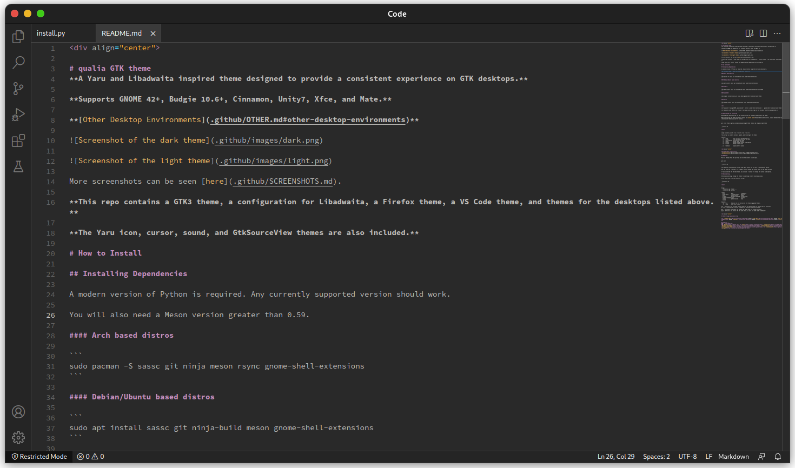

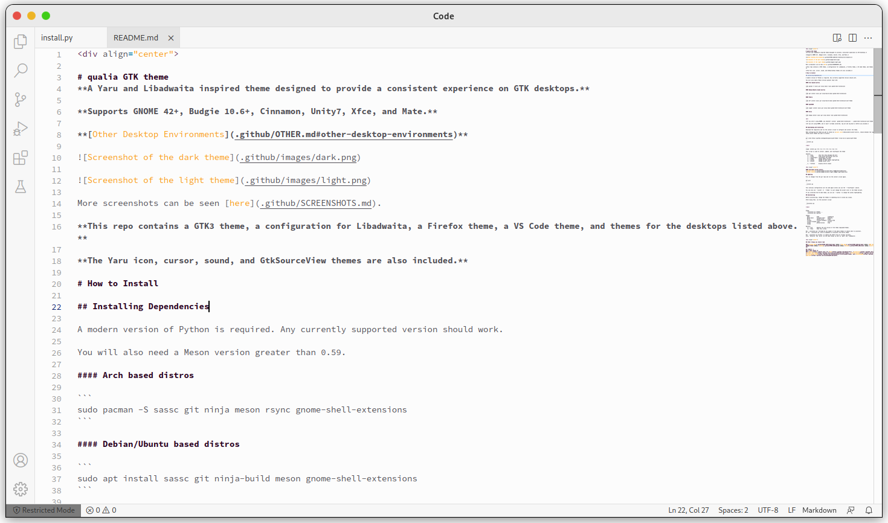

## Cinnamon

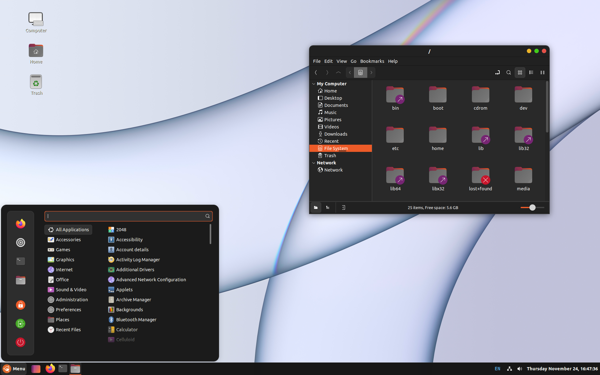

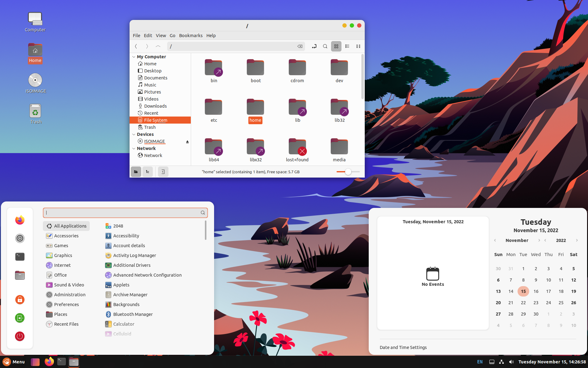

## Budgie

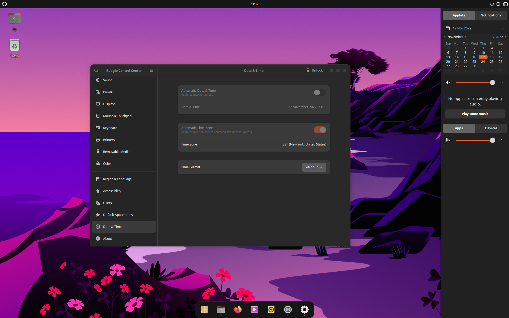

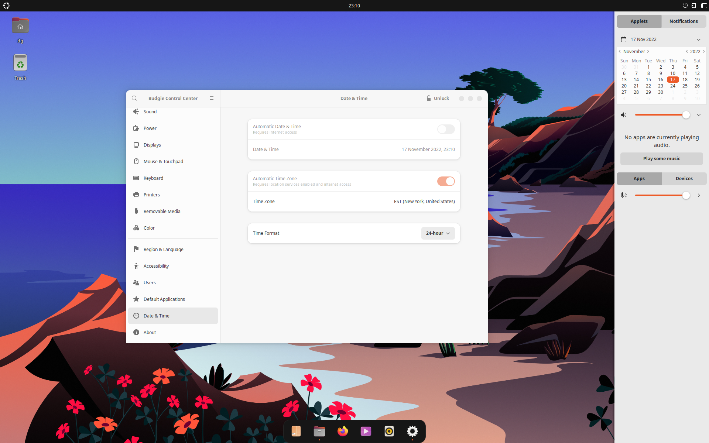

## Mate

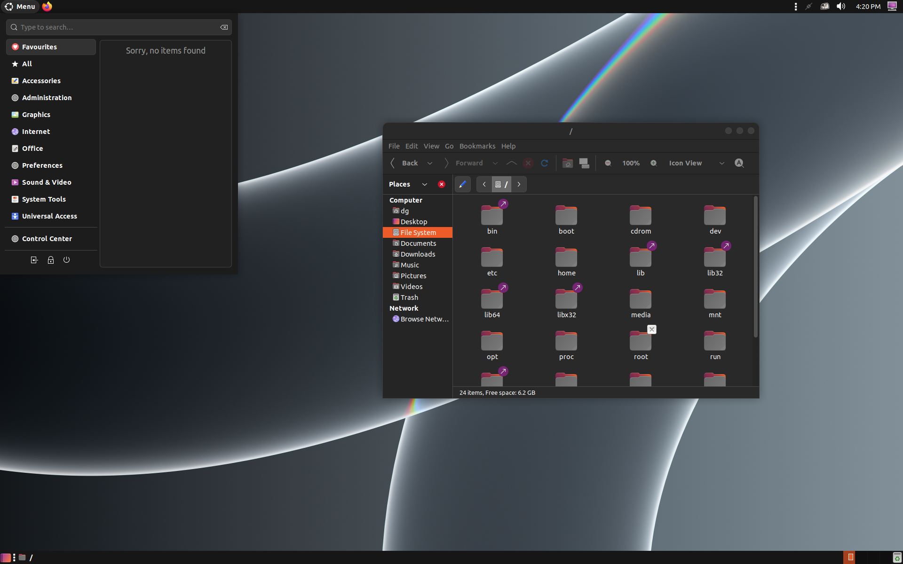

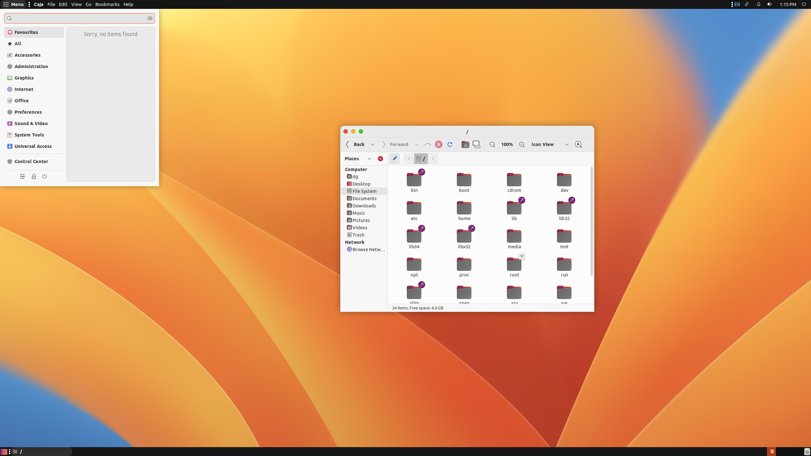

## Xfce

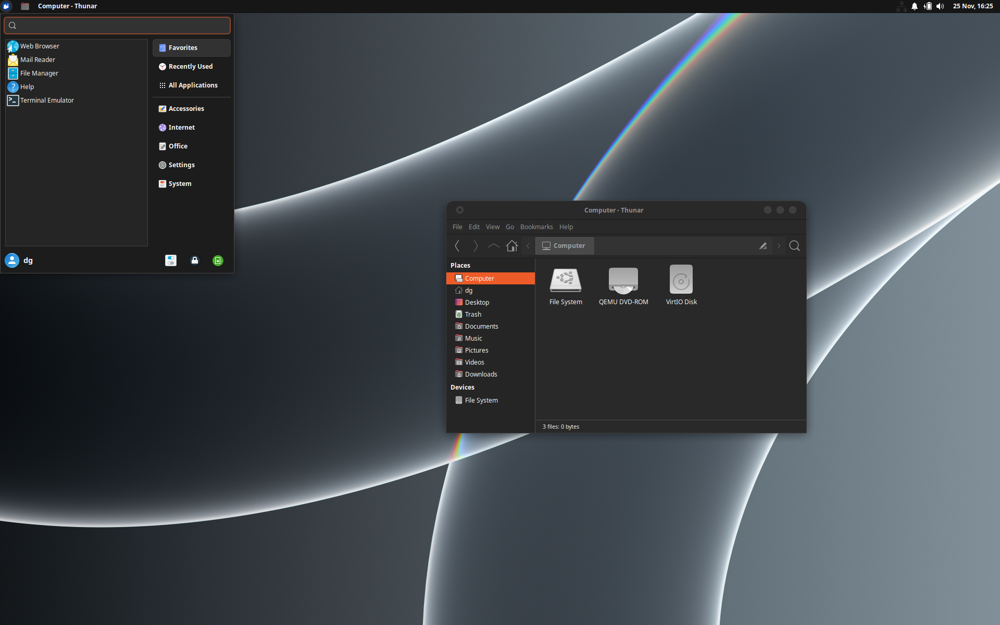

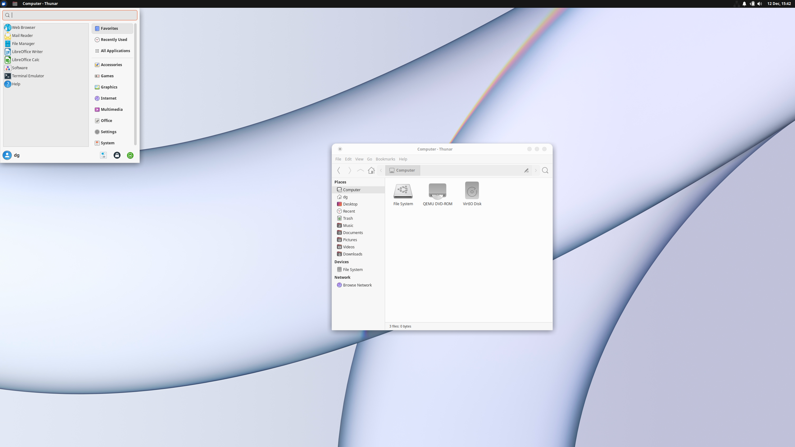

## Unity

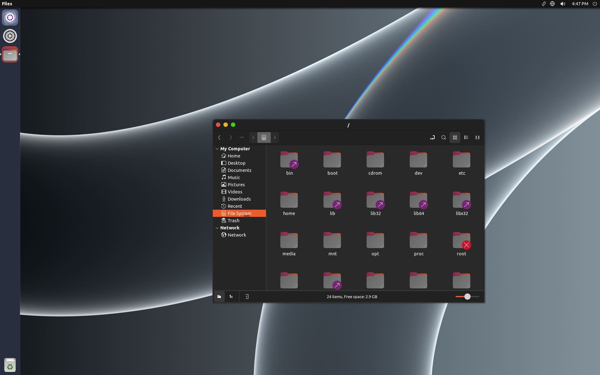

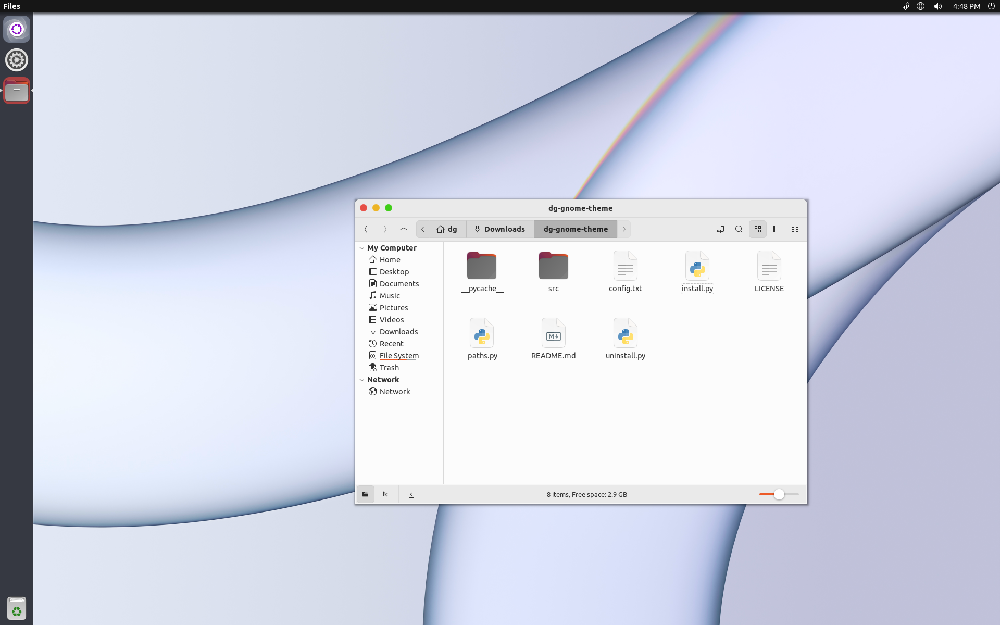
