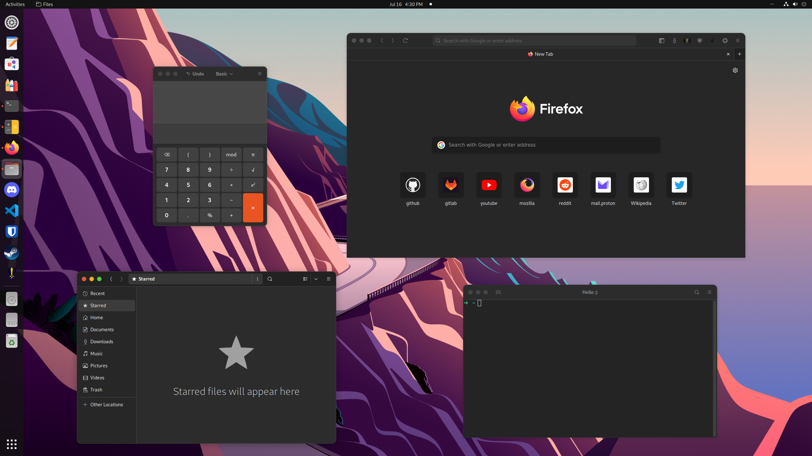
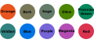

<div align="center">

# dg GNOME theme
**A Libadwaita + macOS + Yaru theme for GNOME 42**

*Kinda crazy but I like the look of it.*



**This repo contains a gtk3 theme, a configuration for Libadwaita, a Firefox theme, and a GNOME Shell theme. The Yaru icon, cursor, and sound themes are also included.**
# How to install

</div>

## Installing Dependencies

- Arch based distros: `sudo pacman -S sassc git gnome-shell-extensions ninja meson`

- Debian and Ubuntu based distros: `sudo apt-get install sassc git gnome-shell-extensions ninja-build meson`

- Fedora: `sudo dnf install sassc git gnome-shell-extension-user-theme ninja-build meson`

- openSUSE: `sudo zypper install sassc git gnome-shell-extension-user-theme ninja meson`

**If `gnome-shell-extension-user-theme` wasn't already installed, log out and log back in before you proceed.**

## Downloading and Installing

```
git clone https://github.com/dgmarie/dg-gnome-theme
```
```
cd dg-gnome-theme
```
```
./install.sh
```
**Log out and log back in after installing for everything to be updated.**

#### Available Options:
- `-a, --accent` `[orange|bark|sage|olive|viridian|prussiangreen|blue|purple|magenta|red]`
	- Specify yaru accent color variant (See image below)
	- Default: `orange`
- `-f, --firefox` `[none|default|flatpak]`
	- Specify where to install the firefox theme
	- Default: `none`
- `-v, --verbose`
	- Shows meson output, use this option in case something isn't working and you want to know why
- `-h, --help`
	- Show help



#### Example:
```
./install.sh -a purple -f flatpak
```

### Warning!
**The installation script changes some preferences in GNOME depending on the options you choose.**

The preferences being changed are `org.gnome.desktop.interface icon-theme` `org.gnome.desktop.interface gtk-theme` and `org.gnome.shell.extensions.user-theme name`.

**Also if you change between light and dark theme in the settings app, run the install script again to update everything.**

## Flatpak apps
Run this command to let Flatpak apps access this theme:
```
flatpak override --user --filesystem=xdg-config/gtk-4.0 --filesystem=xdg-data/themes
```

## Updating
```
git pull
```
And then run installation script again

## Uninstalling
```
./uninstall.sh
```

## GDM Theme
I recommend using [gdm-tools](https://github.com/realmazharhussain/gdm-tools) to change the GDM theme to dg-yaru

## Credits
Thanks to Ubuntu for [Yaru](https://github.com/ubuntu/yaru), [vinceliuice](https://github.com/vinceliuice) for [WhiteSur-gtk-theme](https://github.com/vinceliuice/WhiteSur-gtk-theme) and [Colloid-gtk-theme](https://github.com/vinceliuice/Colloid-gtk-theme), [rafaelmardojai](https://github.com/rafaelmardojai) for [firefox-gnome-theme](https://github.com/rafaelmardojai/firefox-gnome-theme) and [lassekongo83](https://github.com/lassekongo83) for [adw-gtk3](https://github.com/lassekongo83/adw-gtk3)
