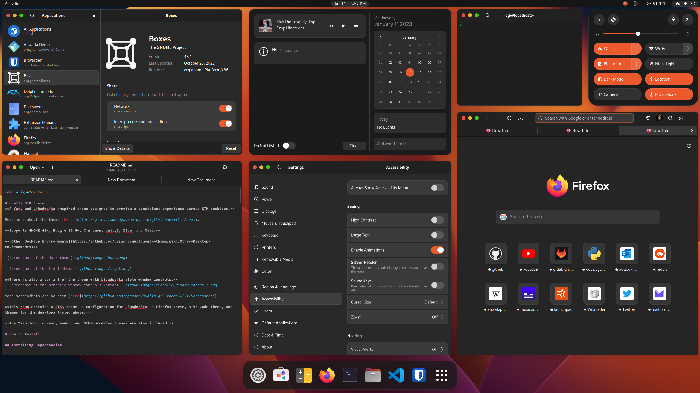
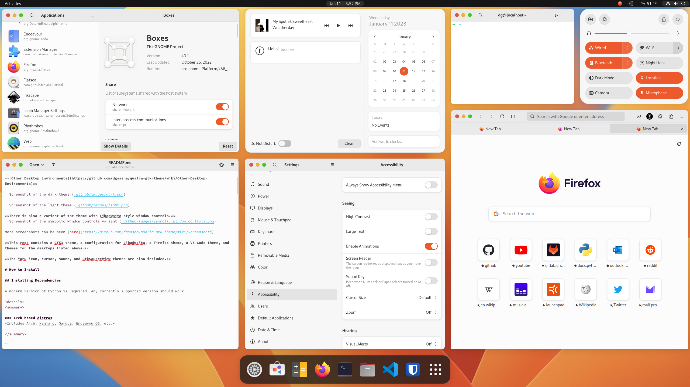

<div align="center">

# qualia GTK theme
**A Yaru and Libadwaita inspired theme designed to provide a consistent experience across GTK desktops.**

Read more about the theme [here](https://github.com/dgsasha/qualia-gtk-theme/wiki/About).

**Supports GNOME 42+, Budgie 10.6+, Cinnamon, Unity7, Xfce, and Mate.**

**[Other Desktop Environments](https://github.com/dgsasha/qualia-gtk-theme/wiki/Other-Desktop-Environments)**





More screenshots can be seen [here](https://github.com/dgsasha/qualia-gtk-theme/wiki/Screenshots).

**This repo contains a GTK3 theme, a configuration for Libadwaita, a Firefox theme, a VS Code theme, and themes for the desktops listed above.**
  
**The Yaru icon, cursor, sound, and GtkSourceView themes are also included.**

# How to Install

## Installing Dependencies

A modern version of Python is required. Any currently supported version should work.

<details>
<summary>

### Arch based distros
*Includes Arch, Manjaro, Garuda, EndeavourOS, etc.*

</summary>

```
sudo pacman -S sassc git ninja meson rsync
```

**If using GNOME, also run this and then log out and log back in:**

```
sudo pacman -S gnome-shell-extensions
```

</details>

<details>
<summary>

### Debian/Ubuntu based distros
*Includes Debian, Ubuntu (and all Ubuntu Remixes), Pop!_OS, Zorin OS, etc.*

</summary>

<details>
<summary>

#### Debian base >= 'bookworm' or Ubuntu base >= 22.04
*Also includes [bullseye-backports](https://backports.debian.org/Instructions/) and Debian branches like sid/testing.*

</summary>

```
sudo apt-get install sassc git ninja-build meson
```

**If using GNOME, also run this and then log out and log back in:**

```
sudo apt-get install gnome-shell-extensions
```

</details>

<details>
<summary>

#### Debian base <= 'bullseye' or Ubuntu base <= 20.04
*Includes some Ubuntu based distros like Zorin OS.*

*The GNOME Shell theme will not work on distros this old.*

</summary>

```
sudo apt-get install sassc git python3-pip
```
```
sudo pip install meson ninja
```
**If using GNOME, also run this and then log out and log back in:**
```
sudo apt-get install gnome-shell-extensions
```

</details>

</details>

<details>
<summary>

### Fedora based distros
*Includes Fedora (and all Fedora Spins), Nobara, risiOS, etc.*

</summary>

```
sudo dnf install sassc git ninja-build meson
```

**If using GNOME, also run this and then log out and log back in:**

```
sudo dnf install gnome-shell-extension-user-theme
```

</details>

<details>
<summary>

### OpenSUSE based distros
*Includes OpenSUSE Tumbleweed and GeckoLinux Rolling, openSUSE Leap probably isn't supported.*

</summary>

```
sudo zypper install sassc git ninja meson
```

**If using GNOME, also run this and then log out and log back in:**

```
sudo zypper install gnome-shell-extension-user-theme
```

</details>

<details>
<summary>

### Solus
*Includes all Solus editions.*

</summary>

```
sudo eopkg install sassc git ninja meson rsync gnome-shell-extensions
```

**If using GNOME, also run this and then log out and log back in:**

```
sudo eopkg install gnome-shell-extensions
```

</details>

## Downloading and Installing

#### First, download the repository.

If storage space / network usage is not a problem, run this:
```
git clone https://github.com/dgsasha/qualia-gtk-theme -b main && cd qualia-gtk-theme
```
If you want to limit the download size and don't plan on contributing, run this instead:
```
git clone --depth=1 --recurse-submodules --shallow-submodules https://github.com/dgsasha/qualia-gtk-theme -b main && cd qualia-gtk-theme
```

#### Next, run the install script to configure and install the theme.

When configuring the theme you get to choose an [accent color](#available-accent-colors), choose between the light and dark variants, and choose which themes you want to install.

If you are going to install the Firefox theme, read [this](https://github.com/dgsasha/qualia-gtk-theme/wiki/Firefox-Theme) first, and if you are going to install the VS Code theme, read [this](https://github.com/dgsasha/qualia-gtk-theme/wiki/VS-Code-Theme) first.

```
./install.py
```

</div>

```
usage: install.py [-h] [-c] [-r] [-t] [-s] [-a] [-f] [-n] [-v]

This script is used to install, update, and reconfigure the theme

options:
  -h, --help         show this help message and exit
  -c, --clean        clean build directories and exit
  -r, --reconfigure  reconfigure the theme
  -t, --theme        change theme variant
  -s, --syntax       change VS Code syntax highlighting
  -F, --firefox      change Firefox settings theming
  -a, --accent       change accent color
  -f, --force        force install the theme
  -n, --no-update    don't update the submodules, useful if you made local changes
  -v, --verbose      verbose mode
```

<div align="center">

#### Available Accent Colors:


## Updating

You should try to update the theme frequently, and always make sure it is up to date before opening issues.

To update, pull in changes from the git repo and run the install script again.

```
git pull
```
```
./install.py
```

Only the themes that have updates will be reinstalled, if you want to force reinstall everything, use the `--force` option.

Your previous configuration will be used again unless you use the `--reconfigure` option.

You can also use `--accent` or `--theme` to just change the accent color or the theme variant.

If you installed the VS Code theme, you can use `--syntax` to change the syntax highlighting.

If you installed the Firefox theme, you can use `--firefox` to change the settings theming.

<details>
<summary>

#### Warning about GNOME

</summary>

The GNOME Shell often changes a lot between major releases. For this reason you will always need to run `./install.py` after updating GNOME to make sure the latest version of the theme is installed. You should probably do this for other desktops as well, just in case there are changes.

You should also probably avoid using alpha builds of GNOME because I might not have the theme updated to support them yet.

</details>

## Uninstalling
```
./uninstall.py
```

</div>

```
Usage:
    ./uninstall.py <option> <theme> ...

Themes:
    gtk3            gtk4-libadwaita  gnome-shell
    cinnamon-shell  metacity         ubuntu-unity
    xfwm4           firefox          firefox-standard
    firefox-snap    firefox-flatpak  icons
    cursors         sounds           gtksourceview
    snap            vscode           gtk4-config

Options:
    -o, --old       Removes the old version of the theme (dg-gnome-theme).
    -v, --verbose   Verbose mode.
    -d, --dry-run   Similar to verbose mode, except nothing is actually deleted.
    -h, --help      Show this screen.

Run './uninstall.py' followed by any number of the above themes to choose what to uninstall.
Or run './uninstall.py' with no arguments to uninstall the entire theme.

Run './uninstall.py firefox' to remove the theme from all Firefox variants.
```

<div align="center">

## Other things you should read

### [Flatpak Apps](https://github.com/dgsasha/qualia-gtk-theme/wiki/Flatpak-Apps) &nbsp; [Snap Apps](https://github.com/dgsasha/qualia-gtk-theme/wiki/Snap-Apps) &nbsp; [GDM Theme](https://github.com/dgsasha/qualia-gtk-theme/wiki/GDM-Theme) &nbsp; [Copying](https://github.com/dgsasha/qualia-gtk-theme/wiki/Copying) &nbsp; [Issues](https://github.com/dgsasha/qualia-gtk-theme/wiki/Issues) &nbsp; [Contributing](https://github.com/dgsasha/qualia-gtk-theme/wiki/Contributing)

## :heart:&nbsp; Credits &nbsp;:heart:
### A huge thanks to:
### [Ubuntu](https://ubuntu.com/) for [Yaru](https://github.com/ubuntu/yaru), [vinceliuice](https://github.com/vinceliuice) for [WhiteSur-gtk-theme](https://github.com/vinceliuice/WhiteSur-gtk-theme), [rafaelmardojai](https://github.com/rafaelmardojai) for [firefox-gnome-theme](https://github.com/rafaelmardojai/firefox-gnome-theme), [piousdeer](https://github.com/piousdeer) for [vscode-adwaita](https://github.com/piousdeer/vscode-adwaita), and [lassekongo83](https://github.com/lassekongo83) for [adw-gtk3](https://github.com/lassekongo83/adw-gtk3).

</div>